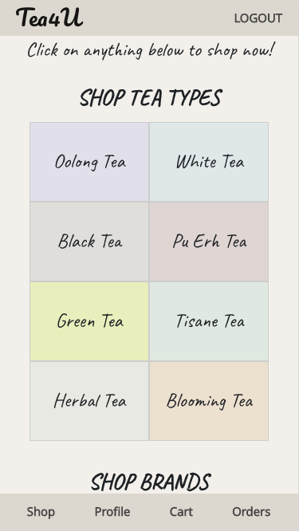

# Tea4U - Ecommerce Website selling Tea Leaves
 
Access the live demo ecommerce website of [Tea4U](https://tea4u-tgc18.netlify.app/).

For github repository of database and order management by admin, refer to [Tea4U-Express-Backend](https://github.com/joanneks/Tea4U-Express-Backend). 

Test Accounts:
1. Tea4U : https://tea4u-tgc18.netlify.app/
    - Email: jonsnow1@gmail.com
    - Password: Jonsnow1!

2. Tea4U-Express-Backend : https://tea4u-express-tgc18.herokuapp.com/
    - Email: admin@tea4u.com
    - Password: Tadmin1!

## **Overview**

Tea4U is an e-commerce platform selling tea leaves from procured from various brands. Tea leaves are very unique, even with the same name, it can taste different based on its origin and methods of preparation. Hence, we aim to be a one-stop provider for a wider range of tea leave products. This is something that each brand cannot do, reach a wider range of target audience due to their limited product sources or specialisations in a type of tea/area/preparation etc.

### **Branding**
The name "Tea4U" was selected because it is self-explanatory and evident to others what the website is going to be about. "4U" stands for "for you" which gives the website a personal touch.

### **Target Audience**

It refers to people who are:
- interested in tea leaves and want to buy for themselves or
- want to buy a gift for others

#### **User Goal** 
To look for tea products that match their requirements or what they want.

#### **User Pain Points** 
Users may not know what they want or need when they enter a website but they may hope to:
- find a deciding factor that encourages them to make a purchase at Tea4U.
- find a product that they are looking for in particular
- gain new information for a better search after visiting Tea4U.

Users may like certain products from different brands but may have to incur separate delivery charges for each brand.

#### **User Needs** 
- To find a product that they desire through a deciding factor. 
- To find a product that meets their requirements of a particular tea, brand or type.
- To find out the tea types and product range that Tea4U has, either for purchase at Tea4U or comparison with other competitors.
- To buy what they want at the lowest cost or convenience.

### **Organisation's Goals**

- To feed them relevant tea information and picture that may become a deciding factor for them to make a purchase at Tea4U.
- To help them find what they want or need.
- Use the homepage to attract and entice target audience to click in and view the product range we have.
- To gain larger sales volume and customer base by providing a wider range of brands and products. 
    - Rationale #1: Customers may have to buy separately from different brands, whilst incurring separate delivery fees at the same time.
    - Rationale #2: Customers tend to buy more or consolidate their orders to make their delivery fee worthwhile.
- To gain revenue by charging commission to brand partners based on sales volume.

*Note: through order management/consolidation and having an in-house delivery van, we aim to make our deliveries as efficient as possible to reduce internal costs so as to have greater profits.

## **UIUX**

### **Strategy**

#### **Mechanical Keyboard Users** 

| User Stories | Acceptance Criteria | 
| ----------- | ----------- |
|  To find out if Tea4U has the product or requirements that I want | Products to be searchable by various criteria
| To find a product that makes me want to buy it for myself or friends | To have sufficient information/picture  that will pique the customer's interest |
| To find out the prices and product range available at Tea4U so that comparison can be made to determine who has the better product or price point | Products have essential information for comparison such as price, weight, origin |

### **Scope**

#### **Database design and Structure**
Entity Relationship Diagram (ERD):

Logical Schema:

#### **Content** 
Products are set in the backend by the admin (admin account provided above) via an [express server](https://tea4u-express-tgc18.herokuapp.com/user/login). Any new users have to be created by the admin to ensure that only authorised access is allowed and that integrity of the data is maintained. 

#### **Functional Requirements**

1. Ecommerce Platform
    - Search filters for tea by:
        - name, tea type, brand, packaging, origin, taste profile, minimum/maximum cost indicated
    - Display product listing page and product details page
    - Customer registration and login
    - Customer details and password management
    - Cart: Add to cart from product listing page, add/minus quantity by 1 in the cart page, add to cart by quantity more than 1 from product page
    - Checkout and payment
    - Display order listing page and order details page page
2. Admin Panel
    - Search filters for tea by:
        - name, tea type, brand, packaging, origin, taste profile, minimum/maximum cost and stock indicated
    - Login of admin users and admin user management: 
        - registration, delete, update of user details and password.
    - Customer management: edit and delete of customer details.
    - Product management: Create, edit and delete of products
    - Orders management: Update order details/status and search for orders (Id, customer email, status, shipping method)

#### **Non-Functional Requirements**
- Mobile Responsiveness (small phone, tablet, laptop)
- Loading gif while data is fetching from restful API
- Popup indicating expand/collapse when the mouse hovers over the more filters button in the search bar in the products page

### **Structure**

- #### **Frontend**
    - Structure React: 

- #### **Backend**
    - Structure Express: 

### **Skeleton**

An initial wireframe of the site layout for the frontend React App can be accessed [here](https://docs.google.com/presentation/d/1DEsPS0jhX7Blf5UgZM9v7GFPKB8o8AdL5vmU-fHodb8/edit?usp=sharing)

### **Surface**
1. Colours
    - The main colours used are: 
        

            

#E2DDD4

 
            

#F5F2EE

            

#E2D6D4

        

    - The pastel colours selected have a warm colour tone to it to match the warm colour tone of tea.
    - Other colours have been used to make the home page more attractive to users to induce them to click into the tea type options. The Profile page and Orders page also have color variations of #E2D6D4
    
        
    

2. Fonts
   - 
Pacifico, cursive was used for the Brand Name: Tea4U

   - 
Caveat was used for most of the fonts on the homepage

   - 
Indie Flower was used for the words on the homepage header pic

   - 
Khula, sans-serif was used for most of the other website pages

    

3. Icons
   - Used for edit, delete, clear search, more details functions.

## **Testing of Website**
Test Cases can be found [here](https://docs.google.com/spreadsheets/d/1pHJX0epwqMZXZ6begHmw0Brv4i67bn3sBsKAMFGcJGA/edit?usp=sharing)

### **Possible Enhancements**
1. More notifications if login is required
2.

## **Deployment**

### **_Backend_**
Deployment for express server was completed using [Heroku](https://dashboard.heroku.com/apps).

### **Environment variables used for backend**

DB_DRIVER=
 
DB_USER=
 
DB_PASSWORD=
 
DB_DATABASE=
 
DB_HOST=
 
CLOUDINARY_NAME=
 
CLOUDINARY_API_KEY=
 
CLOUDINARY_API_SECRET=
 
CLOUDINARY_UPLOAD_PRESET=
 
SESSION_SECRET=
 
STRIPE_PUBLISHABLE_KEY=
 
STRIPE_SECRET_KEY=
 
STRIPE_SUCCESS_URL=
 
STRIPE_CANCEL_URL=
 
STRIPE_ENDPOINT_SECRET=
 
TOKEN_SECRET=
 
REFRESH_TOKEN_SECRET=

## **Technologies and Other Sources Used**

### **_Frontend Technologies_**
1. [ReactJS](https://reactjs.org/) for frontend framework
2. [react-router-dom](https://v5.reactrouter.com/web/guides/quick-start) for path routing in React App
3. [Axios](https://cdnjs.com/libraries/axios) for API requests
4. [jwt_decode](https://www.npmjs.com/package/jwt-decode) to check access token validity
5. [Stripe](https://stripe.com/en-gb-sg) for payment and checkout
6. [MomentJS](https://momentjs.com/docs/) for date and time display
7. [ReactToastify](https://www.npmjs.com/package/react-toastify) for toast notifications
8. [React Bootstrap](https://react-bootstrap.github.io/) for HTML, CSS Styling
9. [Bootstrap](https://getbootstrap.com/docs/5.2/getting-started/introduction/) for HTML, CSS Styling
    - Dropdown menu,input group (Text, Email), Navbar
10. [GoogleFonts](https://fonts.google.com/) for CSS styling

### **_Backend Technologies_**
1. [Express & NodeJS](https://fonts.google.com/) as framework for API endpoints and hbs
2. [db-migrate](https://db-migrate.readthedocs.io/en/latest/API/SQL/) for database migration
3. [Bookshelf](https://bookshelfjs.org/index.html) for accessing database
4. [cors middleware](https://expressjs.com/en/resources/middleware/cors.html) to enable CORS
5. [dotenv](https://www.npmjs.com/package/dotenv) for .env file containing environment variables
6. [Caolan forms](https://github.com/caolan/forms) for form creation and validation
6. [MomentJS](https://momentjs.com/docs/) for date and time display
7. [express-session]() to manage sessions
9. [express-flash] to display flash messages
10. [jsonwebtoken](https://www.npmjs.com/package/jsonwebtoken) for user authentication on front-end
11. [hbs](https://www.npmjs.com/package/hbs) to generate template
12. [handlebarhelpers](https://handlebarsjs.com/guide/builtin-helpers.html)
13. [Cloudinary](https://cloudinary.com/documentation/image_video_and_file_upload) for image upload
14. [Bootstrap](https://getbootstrap.com/docs/5.2/getting-started/introduction/) for HTML, CSS Styling
    - button, navbar, tabs

### **_Platform and Softwares_**
1. [Gitpod] (https://gitpod.io/workspaces) for version control
2. [Github] (https://github.com/) for code editing and respository
3. [Netlify] (https://www.netlify.com/) for frontend React deployment
4. [Heroku] (https://www.heroku.com/) for backend Express deployment
5. [mySQL] (https://www.npmjs.com/package/mysql) for accessing mySQL database on gitpod
6. [DBeaver](https://dbeaver.io/) for accessing postgres database on heroku

### **_Database Information Sources_**
- [Kindred Teas](https://kindredteas.com/)
- [Tea Chapter](https://teachapter.com/)
- [Tea Spoon of Love](https://www.tspoflove.com/)
- [Qi Cha](https://qi-cha.store/)
- [Petale Tea](https://www.petaletea.com/)
- [Pryce Tea](https://prycetea.com/)
- [Pekoe and Imp](https://www.pekoeandimp.com/)

### **_Image and Icon Sources_**

|[Flaticon](https://www.flaticon.com/) - Icon made by | Image name in gitpod |
| ---------------- | ----------- |
| Freepik | cart.png, pay.png, filter.png|
| SOFIKDESIGN  | search.png|
| DigbyGarret | info.png|
| dmitri13 | add.png, minus.png, remove.png|

|Used in |Image Purpose | Image name in gitpod |
| ---------------- | ---------------- | ----------- |
| HomePage | Carousel - Kindred Teas| [kindred.webp](https://cdn.shopify.com/s/files/1/1558/2721/files/setup-10.png?v=1517041196)|
| HomePage | Carousel - Petale| [petale.jpeg](https://numitea.com/wp-content/uploads/2020/07/numi-organic-tea-flowering-tea.jpg)|
| HomePage | Carousel - Tea Spoon of Love| [teaspo.jpeg](https://images.squarespace-cdn.com/content/v1/535f243be4b09e1f27e8003d/1627991469429-YDYFCEKZJ4VC2NAO16JA/DSCF9218+copy.JPG?format=1500w)|
| HomePage | Header Picture| [home.webp](https://img.freepik.com/premium-photo/tea-cups-with-copy-space_23-2148555401.jpg?w=2000)|

Loading.gif (used in some pages): 
<a href="https://iconscout.com/lotties/astronaut" target="_blank">Astronaut in Tea break Animated Icon</a> by <a href="https://iconscout.com/contributors/israfil-hossain-anik">Israfil Hossain</a> on <a href="https://iconscout.com">IconScout</a>

### **_Other Sources_**
1. Lecturer (Paul Chor) for his slides, tutorials and notes
2. Teaching Assistants/Friends (Ace Liang, Shun, Evelyn Tan) for their guidance
3. [StackOverFlow](https://stackoverflow.com/) for guidance
4. [W3schools](https://www.w3schools.com/) for HTML, CSS, Javascript guidance
